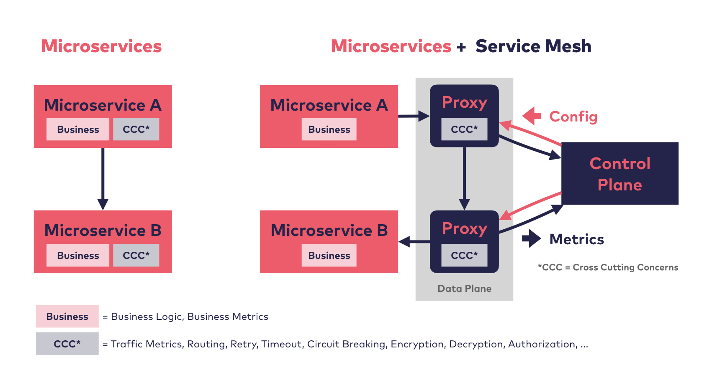

# （翻译）服务网格的对比

原文：[Service Mesh Comparison](https://servicemesh.es/)

## 什么是服务网格？

服务网格是一个专用的基础设施层，它为服务之间的网络添加功能。 它允许控制流量并获得对整个系统的洞察能力。 可观察性、流量转移（如金丝雀发布）、弹性功能（例如断路器，请求重试和超时等设置）和自动双向 TLS (mutual TLS) 只需一次配置便以分散的方式强制执行。 与类似功能的类库 (libraries) 相比，服务网格不需要修改代码。 相反，它添加了一层额外的容器，这些容器可靠地实现了这些功能，并且与技术或编程语言无关。

## 服务网格框架

### 没有使用服务网格 (上图左边部分)，

... 每个微服务必须自己实现业务逻辑和[横切关注点](https://en.wikipedia.org/wiki/Cross-cutting_concern)（CCC）。

### 使用了服务网格 (上图右边部分)，

... 流量指标、路由和加密等许多 CCC 从微服务中被移出并进入代理（数据平面，Data Plane）。业务逻辑和业务指标依然保留在微服务中。 进出的请求由代理透明地进行路由。 除了一层代理（数据平面）之外，服务网格还添加了一个所谓的控制平面 (Control Plane)。它将配置更新分发给所有代理并接收由代理收集的指标以进行后续处理，例如通过 Prometheus 等监控基础设施对指标数据进一步处理。

## 谁需要服务网格？

服务网格的价值随着应用所包含的服务数量而增长。从逻辑上讲，微服务架构是服务网格最常见的用例。然而，具体的交互可能与服务网格如何提高服务的控制、可靠性、安全性和可观察性更相关。即使是单体应用（monolith）也可以从服务网格中受益，而某些具体的微服务应用可能不会。

## 服务网格实现

### [Istio](https://istio.io/)

如果您听说过服务网格，那么您可能也听说过 Istio。Istio 是迄今为止最受欢迎的服务网格，因为它具有丰富的功能集以及 Google 和 IBM 的支持。

### [Linkerd](https://linkerd.io/)

Linkerd 是第一个服务网格。 最新版本 2.x 版本致力于简单、性能和构建在 Kubernetes 之上作为底层平台。

### [Consul](https://www.consul.io/)

HashiCorp Consul 长期以来一直以服务发现解决方案而闻名。 现在它采用了 Envoy 代理和 Sidecar 模式，Consul 可以作为服务网格服务于各种平台，如 Kubernetes 和 VM。

### [AWS App Mesh](https://aws.amazon.com/app-mesh/)

在服务网格大肆宣传后不久，AWS 为 AWS 上的应用添加了自己的服务网格。

### [Traefik Mesh](https://traefik.io/traefik-mesh/)

顾名思义，Traefik Mesh（以前称为 Maesh）是基于云原生 API 网关 Traefik 的服务网格。

### [Kuma](https://kuma.io/)

Kuma 是使用 Envoy 和由 Kong API 网关的开发人员开发的 sidecar 模式的服务网格。 它专注于多云，可以运行非 Kubernetes 工作负载。

### [Open Service Mesh (OSM)](https://openservicemesh.io/)

OSM 是由 Microsoft 最新实现的服务网格，它遵循常见的服务网格设计原则，例如采用 Envoy 代理，实现 SMI 规范。

### [Cilium](https://cilium.io/)

Cilium 早在 Service Mesh 一词出现之前就已经存在，它通过 eBPF 而不是 sidecars 有效地提供了安全、网络和可观察性功能。

## 服务网格接口 (SMI)

[SMI](https://smi-spec.io/) 不是服务网格，而是服务网格功能的 API 规范。 它由 Microsoft、Buoyant（开发 Linkerd）和 HashiCorp（开发 Consul）构建，旨在为如何配置服务网格功能创建一个通用标准，而不管底层服务网格实现如何。该服务网格接口规范允许基于服务网格功能的工具（例如仪表板、金丝雀发布等自动化工具....）的与实现无关的开发。当针对 SMI 开发时，工具将与任何符合 SMI 的服务网格相兼容。服务网格用户还可以从无需修改配置即可更换其服务网格实现的能力中受益。

## 如何选择服务网格实现

虽然服务网格对代码没有影响，但它们会改变操作过程并需要熟悉新的概念和技术。所以，尤其是在服务网格接口（SMI）得到广泛支持之前 —— 采用服务网格实现是一个长期的决定。因此，应事先仔细比较和测试这些服务网格实现。一开始，选择具有最多功能的、最灵活的服务网格似乎是合乎逻辑的。但情况可能恰恰相反，因为功能和灵活性通常需要付出认知和技术复杂性的代价。

评估的目的是找出哪些功能对您很重要，以及您如何从中受益。由于服务网格会影响延迟和资源消耗，因此也必须衡量这些缺点。

我们建议在您的决策过程中包括以下步骤：

- 作为一个团队，确定什么是服务网格要解决的最重要的问题。请记住，在某些情况下，类库或对现有架构的调整可能是不错的选择（见下文）。

- 讨论您对简单性/可用性、性能和兼容性的要求。

- 根据您的功能和非功能需求选择您的最合适的两三个服务网格实现。下表应该对您有所帮助。

- 通过学习服务网格提供的各自的教程（下面的链接）来试着使用服务网格实现，并可能放弃部分候选者来减少选择范围。

- 测试您的单个应用的延迟和资源开销。对于每个候选服务网格实现，设置相同的测试环境并安装服务网格。设置一个额外的无服务网格的环境作为对比环境。在所有环境中安装您的应用。使用 [Locust](https://locust.io/) 或 [Fortio](https://fortio.org/) 等工具执行负载测试并测量请求延迟、CPU 和内存消耗。

## 对比不同的服务网格实现

|   | Istio | Linkerd | AWS App Mesh | Consul | Traefik Mesh (formerly Maesh) | Kuma | Open Service Mesh (OSM) | Cilium |
|----|----|----|----|----|----|----|----|----|
| **当前版本** | 1.13 | 2.11 | | 1.13 | 1.4 | 1.7 | 1.0 | 1.12 |
| **许可** | Apache License 2.0 | Apache License 2.0 | Closed Source | Mozilla License | Apache License 2.0 | Apache License 2.0 | Apache License 2.0 | Apache License 2.0 |
| **发起者** | Google, IBM, Lyft | Buoyant | AWS | HashiCorp | Traefik Labs | Kong | Microsoft | Cilium |
| **服务代理** | Envoy, proxyless for gRPC (experimental) | Linkerd2-proxy | Envoy | defaults to Envoy, exchangeable | Traefik Proxy on each node | Envoy | Envoy | Cilium agent on each node, Proxy Injection option for L7 (Envoy) |
| **入口控制器** | Envoy / Own Concept, support for Kubernetes Gateway API | any |  | Envoy. Support for Kubernetes Gateway API with Consul API Gateway | any | any | prepared config for Contour, compatible with any other | Cilium Ingress for TLS & path-based routing features, compatible with any other |
| **服务治理** | see Istio Community and Open Usage Commons | see Linkerd Governance and CNCF Charter | AWS | see Contributing to Consul | see Contributing notice | see Contributing notice, Governance, and CNCF Charter | see Contributing notice and CNCF Charter | see Governance |
| **入门教程** | Istio Tasks | Linkerd Getting Started Guide | AWS App Mesh Getting Started | HashiCorp Learn platform | Traefik Mesh Example | Install Kuma on Kubernetes | Install OSM on Kubernetes | Cilium Quick Installation |
| **是否用于生产** | yes | yes |  | yes |  |  |  | yes |
| **优点**  | Istio can be adapted and extended like no other mesh. Its many features are available for Kubernetes and other platforms. | Linkerd is designed to be non-invasive and is optimized for performance and usability. Therefore, it requires little time to adopt. | AWS App Mesh is integrated into the AWS landscape and it is fully managed for you. | Consul service mesh can be used in any Consul environment and therefore does not require a scheduler. The proxy can be changed and extended. | Traefik Mesh focuses on a selection of features to achieve good usability and performance. | Kuma supports both Kubernetes and VMs - including hybrid multi-zone deployments - and scales to many autonomous zones with different network constraints, it also allows you to customize the Envoy Proxy. | OpenServiceMesh is driven by Microsoft and therefore expected to be well integrated with Azure. It also supports the SMI API. | Cilium takes a different approach on service mesh by making use of eBPF and therefore it doesn't need sidecars at all, which saves complexity and cost.|
| **缺点** | Istio's flexibility can be overwhelming for teams who don't have the capacity for more complex technology. Also, Istio takes control of the ingress controller. | Linkerd is deeply integrated with Kubernetes and does not currently support non-Kubernetes workloads. It also does not currently support data plane extensions. | AWS App Mesh configuration cannot be migrated to an environment outside AWS. | Consul uses its own internal storage, and does not on rely Kubernetes for persistent storage. | Traefik Mesh currently does not support transparent TLS encryption. | Kuma is possibly the most flexible service mesh. Teams should thoroughly consider whether their project can handle the complexity involved. | OpenServiceMesh (OSM) is the latest service mesh Implementation and simply too young to be production-ready. | To enable the same feature set as Service Meshes with sidecars, a lot of maunal configuration is used. |
| **支持的协议** ||
| **TCP**  | yes | yes | yes | yes | yes | yes | yes | yes |
| **HTTP/1.1+** | yes | yes | yes | yes | yes | yes | yes | yes |
| **HTTP/2** | yes | yes | yes | yes | yes | yes | yes | yes |
| **gRPC** | yes | yes | yes | yes | yes | yes | yes | yes |
| **Sidecar / 数据平面** ||
| **自动 Sidecar 注入** | yes | yes | yes | yes | yes (per Node) | yes | yes | yes (per Node) |
| [**CNI**](https://www.cni.dev/) **插件** *避免 Pod 网络特权* | yes, in beta | yes | yes | yes | no | yes | no | not necessary |
| **平台和可扩展性** ||
| **平台** | Kubernetes | Kubernetes | ECS, Fargate, EKS, EC2 | Kubernetes, Nomad, VMs, ECS, Lambda | Kubernetes | Kubernetes, VMs, ECS | Kubernetes | Kubernetes |
| **云集成** | Google Cloud, Alibaba Cloud, IBM Cloud | DigitalOcean | AWS | HCP Consul on AWS and Azure |  |  | Microsoft Azure |
| **网格扩展** *通过集群外的容器或者虚拟机对网格进行扩展* | yes | no | yes, within AWS | yes | no | yes | no | yes |
| **混合云网格** *Control and observe multiple clusters* | yes | yes |  | yes | no | yes | planned | yes |
| **SMI 兼容性** ||
| **访问流量控制** | yes (unofficial/3rd party support) | no | no | yes | yes | no | yes | no |
| **流量规格** | yes (unofficial/3rd party support) | no | no | no | yes | no | yes | no |
| **流量拆分** | yes (unofficial/3rd party support) | yes | no | no | yes | no | yes | no |
| **流量指标** | yes (unofficial/3rd party support) | yes (unofficial/3rd party support) | no | no | no | no | yes | no |
| **监控功能** ||
| **收集服务日志** | no | no | no, use AWS FireLens for ECS and Fargate instead | no | no | no | yes, using Fluent Bit | no |
| **生成访问日志** | yes | no (tap feature instead) | yes | yes | yes | yes | no | yes, via Proxy injection |
| **生成 Golden Signal 指标数据** | yes | yes | yes | yes, depending on the proxy used | yes | yes | yes | yes, L7 metrics via Proxy injection |
| **集成 Prometheus** | yes | yes, in an extension | no | yes, for non-prod environments | yes | yes | yes | yes |
| **集成 Grafana** | yes | yes, in an extension | no | no | yes | yes, including a datasource | yes | yes |
| **路由指标** *分别收集每个 HTTP 端点的指标数值* | experimental | yes |  | depending on the proxy used | no | no | no | yes, via Proxy injection
| **仪表板** | yes, Kiali | yes | yes, AWS Cloud Watch | yes | no | yes, with a service topology map in grafana | no | yes, Hubble |
| **链路跟踪兼容性** | Jaeger, Zipkin, Solarwinds | all Backends supporting OpenTelemetry | AWS X-Ray | Datadog, Jaeger, Zipkin, OpenTracing, Honeycomb | Jaeger | Jaeger, zipkin, datadog | Jaeger | OpenTelemetry via hubble-otel |
| **集成链路跟踪** | yes, Jaeger or Zipkin for nonprod environments | Jaeger, in an extension | yes, AWS X-Ray | yes | yes, Jaeger | yes, Jaeger | yes (install with flag), Jaeger | no |
| **路由** ||
| **负载均衡** | yes (Round Robin, Random, Weighted, Least Request) | yes (EWMA, exponentially weighted moving average) | yes | yes (Round Robin, Random, Weighted, Least Request, Ring Hash, Maglev) | yes | yes (Round Robin, Least Request, Ring Hash, Random, Maglev) | yes | yes |
| **基于百分比的流量拆分** | yes | yes, through SMI | yes | yes | yes, through SMI | yes | yes, through SMI | via manual configuration of Envoy proxy |
| **基于 Header- 和 Path- 的流量拆分** *基于请求头和路径的路由规则* | yes | planned | yes | yes | no | yes | Header-based via SMI | via manual configuration of Envoy proxy |
| **弹性** ||
| **断路器** | yes | no, planned for 2.12.0 | yes | yes | yes | yes | yes | via manual configuration of Envoy proxy |
| **重试和超时** | yes | yes | yes | yes | yes | yes, retry and timeout | no | via manual configuration of Envoy proxy |
| **基于 Path- 和 Method- 的重试和超时** *每个端点的不同重试和超时配置* | yes | yes | yes | yes | no | only Method-based retry other can be done with Proxy templating | no | no |
| **故障注入** | yes | yes, by adding a deployment and a traffic split config |  | no* | no | yes | no | no |
| **延迟注入** | yes | no |  | no* | no | yes | no | no |
| **安全** ||
| **mTLS** | yes | yes, on by default | yes | yes | no | yes | yes | yes, with manually created certs |
| **强制 mTLS** | yes | yes | yes, via client policies | yes | no | yes | yes, via https://linkerd.io/2.11/features/server-policy/ | yes |
| **mTLS 许可模式** | yes | yes |  | no | no | yes | yes |
| **缺省 mTLS** | yes, permissive mode | yes, permissive mode | no | yes | no | no | yes | no |
| **可插拔的外部 CA 证书和密钥** *比如 Vault 证书管理* | yes, CA cert pluggable and CA integration (experimental) | yes | yes | yes, HashiCorp Vault, ACM Private CA, custom CA | no | yes | HashiCorp Vault, cert-manager and Azure Key Vault | yes |
| **服务到服务授权规则** | yes | yes | no, but support for IAM for user-authorization | yes | no | yes | yes | yes |

**或许可以通过代理的配置/模板来实现*

## 这仅仅是一张表格

如需有关 Kubernetes 和 Service Mesh 的建议、培训和支持，请发送电子邮件至 [info@innoq.com](info@innoq.com)

## 服务网格的替代方案

毫无疑问，服务网格是一种有用的模式，当前的一些服务网格实现也非常有前途。 但它们也伴随着技术储备和技术复杂性等挑战。 和其他工具一样，服务网格并非在所有场景下都行之有效的。有的时候，保留现有的众所周知的“无聊”技术或者采用普通的替代解决方案可能也是明智之举。

### 类库（Libraries）

类库是包含在微服务中的。缺点也很明显，类库严重依赖于特定技术和语言，类库的实现可能不一致的风险，类库作为服务基础设施与业务逻辑耦合在一起。

但是，通过熟悉类库的使用，开发人员的生产力可以（至少在短期内）得到很好的提高。另外，有时需要业务范围的知识，例如需要根据业务指标为断路器配置特定的回退业务。在这些情况下，服务网格无法深入到业务级别的配置。

服务网格需要对基础架构进行调整。因此，如果基础架构不能或者不应该被改变时，则无法使用服务网格。有时，即使服务网格只应用于某些特定的服务，改变基础设施的风险也会被认为太高。

### 无（同步通信）微服务

服务网格对于同步通信特别有用。他们通常依靠 HTTP 协议来传输附加信息，例如一个请求是否失败。

采用微服务的原因之一是它们有可能缩短软件的上线时间。尽管存在一些缺点，例如高延迟和紧密耦合，但微服务的同步通信是一种常见的做法。

然而，人们注意到有更多的方法可以实现微服务通信，甚至可以避免对服务网格的依赖（在免费的 [Microservices Recipes Book](https://leanpub.com/microservices-recipes) 中阅读更多内容）。SCS 和异步通信等模式旨在缓解经典（同步通信）微服务的许多问题。当然，您可以使用 HTTP 来实现异步微服务，例如通过轮询的方式获取消息事件。由于服务网格依赖于 HTTP，它们仍然会有一些用处。但是，对于异步通信的弹性功能就显得微不足道了，因为异步通信先天就支持弹性。

举这个例子可能有点无理取闹，对于单体架构而言，服务网格通常甚至不被视为一种解决方案。显而易见，服务网格只能帮助单体应用与其他系统之间的通信，而对于应用内部的通信是毫无帮助的。
